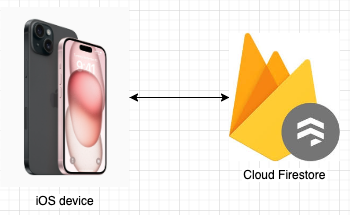

# GymLogCalendar

## Overview
This Gym logging app tracks workouts by featuring a calendar display for reviewing sessions. It is simple and have a clear UI. Firebase Cloud Database is integrated for storing weight and reps data. With user authentication and customizable workouts, it's the my personal tool for tracking my progressive overload workout.

## Features
1. Provide a Google Calendar alike UI.
2. Add and read exercises stored.

## System Architecture
Since this is a light-weighted app, a serverless aparchitecture is used. Its simplicity limits the amount of potential errors.




## Run Locally
1. Clone the project
```bash
  git clone https://github.com/yhmyhm0910/GymLogCalendar
```

2. Go to the project directory
```bash
  cd GymLogCalendar
```

3. Install dependencies for server
```bash
  npm i
```

4. Create a ``.env.local`` file in the root directory and provide information as the following:
```
API_KEY=
AUTH_DOMAIN=
PROJECT_ID=
STORAGE_BUCKET=
MESSAGING_SENDER_ID=
APP_ID=

USERNAME=
```
API_KEY, AUTH_DOMAIN, PROJECT_ID, STORAGE_BUCKET, MESSAGING_SENDER_ID, andd APP_ID are firebase information. USERNAME is a custom name to be stored as a collection name.

5. Start with Expo Go
```bash
  npx expo start
```

## Future development
1. **Scale up with multiple user collections in Firestore.**
2. Add more exercises.
3. Add delete/edit function. (Currently can only be deleted/edit through firestore directly.)
4. Add other pages for other related information.

## Contributing
Feel free to contribute to the project by opening issues, submitting feature requests, or creating pull requests. Your feedback and contributions are highly appreciated!

## License
This project is licensed under the [MIT License](LICENSE).